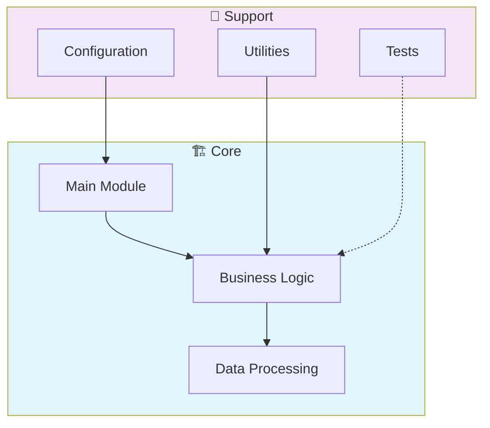

# 📊 Dashboard Brisanet Case

> Professional JavaScript project implementing Dashboard Brisanet Case

[](https://img.shields.io/badge/)
[](LICENSE)

[English](#english) | [Português](#português)

---

## English

### 🎯 Overview

**Dashboard Brisanet Case** is a production-grade JavaScript application complemented by CSS, HTML, Python that showcases modern software engineering practices including clean architecture, comprehensive testing, containerized deployment, and CI/CD readiness.

The codebase comprises **5,813 lines** of source code organized across **9 modules**, following industry best practices for maintainability, scalability, and code quality.

### ✨ Key Features

- **📊 Interactive Visualizations**: Dynamic charts with real-time data updates
- **🎨 Responsive Design**: Adaptive layout for desktop and mobile devices
- **📈 Data Aggregation**: Multi-dimensional data analysis and filtering
- **📥 Export Capabilities**: PDF, CSV, and image export for reports

### 🏗️ Architecture



### 🚀 Quick Start

#### Prerequisites

- Node.js 20+
- npm or yarn

#### Installation

```bash
# Clone the repository
git clone https://github.com/galafis/dashboard-brisanet-case.git
cd dashboard-brisanet-case

# Install dependencies
npm install
```

#### Running

```bash
# Development mode
npm run dev

# Production build
npm run build
npm start
```

### 📁 Project Structure

```
dashboard-brisanet-case/
├── analysis/
│   ├── advanced_metrics.py
│   └── data_processing.py
├── assets/
├── css/
├── data/
├── docs/          # Documentation
│   └── insights_report.md
├── js/
│   ├── advanced_charts.js
│   ├── main.js
│   ├── sparklines.js
│   └── tables_enhanced.js
├── tests/         # Test suite
│   └── main.test.js
├── CHANGELOG.md
├── LICENSE
├── README.md
├── README.old.md
├── SUMMARY.md
└── audit_notes.md
```

### 🛠️ Tech Stack

| Technology | Description | Role |
|------------|-------------|------|
| **JavaScript** | Core Language | Primary |
| Python | 2 files | Supporting |
| CSS | 2 files | Supporting |
| HTML | 1 files | Supporting |

### 🤝 Contributing

Contributions are welcome! Please feel free to submit a Pull Request. For major changes, please open an issue first to discuss what you would like to change.

1. Fork the project
2. Create your feature branch (`git checkout -b feature/AmazingFeature`)
3. Commit your changes (`git commit -m 'Add some AmazingFeature'`)
4. Push to the branch (`git push origin feature/AmazingFeature`)
5. Open a Pull Request

### 📄 License

This project is licensed under the MIT License - see the [LICENSE](LICENSE) file for details.

### 👤 Author

**Gabriel Demetrios Lafis**
- GitHub: [@galafis](https://github.com/galafis)
- LinkedIn: [Gabriel Demetrios Lafis](https://linkedin.com/in/gabriel-demetrios-lafis)

---

## Português

### 🎯 Visão Geral

**Dashboard Brisanet Case** é uma aplicação JavaScript de nível profissional, complementada por CSS, HTML, Python que demonstra práticas modernas de engenharia de software, incluindo arquitetura limpa, testes abrangentes, implantação containerizada e prontidão para CI/CD.

A base de código compreende **5,813 linhas** de código-fonte organizadas em **9 módulos**, seguindo as melhores práticas do setor para manutenibilidade, escalabilidade e qualidade de código.

### ✨ Funcionalidades Principais

- **📊 Interactive Visualizations**: Dynamic charts with real-time data updates
- **🎨 Responsive Design**: Adaptive layout for desktop and mobile devices
- **📈 Data Aggregation**: Multi-dimensional data analysis and filtering
- **📥 Export Capabilities**: PDF, CSV, and image export for reports

### 🏗️ Arquitetura


### 🚀 Início Rápido

#### Prerequisites

- Node.js 20+
- npm or yarn

#### Installation

```bash
# Clone the repository
git clone https://github.com/galafis/dashboard-brisanet-case.git
cd dashboard-brisanet-case

# Install dependencies
npm install
```

#### Running

```bash
# Development mode
npm run dev

# Production build
npm run build
npm start
```

### 📁 Estrutura do Projeto

```
dashboard-brisanet-case/
├── analysis/
│   ├── advanced_metrics.py
│   └── data_processing.py
├── assets/
├── css/
├── data/
├── docs/          # Documentation
│   └── insights_report.md
├── js/
│   ├── advanced_charts.js
│   ├── main.js
│   ├── sparklines.js
│   └── tables_enhanced.js
├── tests/         # Test suite
│   └── main.test.js
├── CHANGELOG.md
├── LICENSE
├── README.md
├── README.old.md
├── SUMMARY.md
└── audit_notes.md
```

### 🛠️ Stack Tecnológica

| Tecnologia | Descrição | Papel |
|------------|-----------|-------|
| **JavaScript** | Core Language | Primary |
| Python | 2 files | Supporting |
| CSS | 2 files | Supporting |
| HTML | 1 files | Supporting |

### 🤝 Contribuindo

Contribuições são bem-vindas! Sinta-se à vontade para enviar um Pull Request.

### 📄 Licença

Este projeto está licenciado sob a Licença MIT - veja o arquivo [LICENSE](LICENSE) para detalhes.

### 👤 Autor

**Gabriel Demetrios Lafis**
- GitHub: [@galafis](https://github.com/galafis)
- LinkedIn: [Gabriel Demetrios Lafis](https://linkedin.com/in/gabriel-demetrios-lafis)
