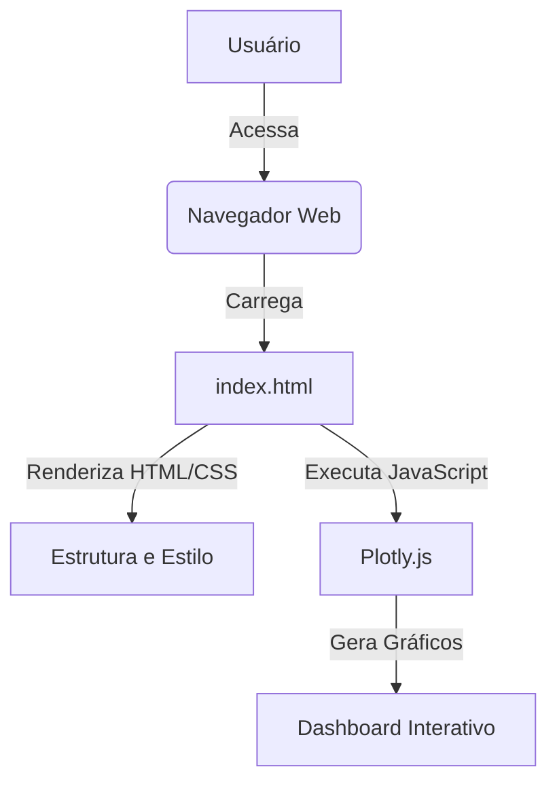

# Dashboard Brisanet

## Visão Geral (Overview)

Este repositório contém um dashboard interativo desenvolvido para a Brisanet, focado na análise de faturamento mensal, dados geográficos e perfil de clientes. O objetivo é fornecer insights claros e acionáveis para a tomada de decisões estratégicas.

This repository contains an interactive dashboard developed for Brisanet, focused on analyzing monthly revenue, geographical data, and customer profiles. The goal is to provide clear and actionable insights for strategic decision-making.

## Tecnologias Utilizadas (Technologies Used)


## Estrutura do Projeto (Project Structure)

```
.github/
├── workflows/
│   └── deploy.yml
├── README.md
├── index.html
├── assets/
│   └── brisanet_logo.png
├── css/
│   └── style.css
└── js/
    └── main.js
```

## Como Visualizar (How to View)

Para visualizar o dashboard, basta abrir o arquivo `index.html` em seu navegador web preferido. Alternativamente, você pode acessar a versão hospedada via GitHub Pages (link será fornecido após a configuração).

To view the dashboard, simply open the `index.html` file in your preferred web browser. Alternatively, you can access the hosted version via GitHub Pages (link will be provided after setup).

## Funcionalidades (Features)

- **Faturamento Mensal:** Gráfico interativo mostrando a evolução do faturamento ao longo dos meses.
- **Análise Geográfica:** Visualização da distribuição de clientes por região.
- **Perfil de Clientes:** Insights sobre a base de clientes, incluindo idade média e taxa de churn.
- **Recomendações Estratégicas:** Sugestões baseadas nos dados analisados.

- **Monthly Revenue:** Interactive chart showing revenue evolution over months.
- **Geographical Analysis:** Visualization of customer distribution by region.
- **Customer Profile:** Insights into the customer base, including average age and churn rate.
- **Strategic Recommendations:** Suggestions based on analyzed data.

## Diagrama de Arquitetura (Architecture Diagram)



## Licença (License)

Este projeto está licenciado sob a Licença MIT. Veja o arquivo `LICENSE` para mais detalhes.

This project is licensed under the MIT License. See the `LICENSE` file for more details.

## Autor (Author)

**Gabriel Demetrios Lafis**

[GitHub](https://github.com/galafis)
[LinkedIn](https://www.linkedin.com/in/gabriel-demetrios-lafis/)

